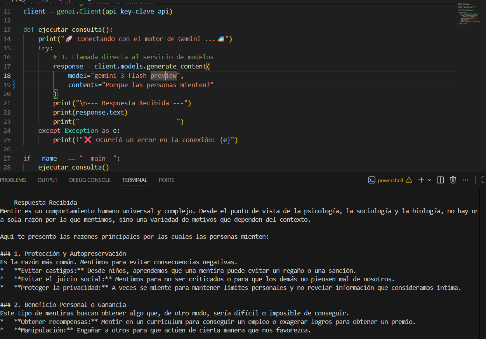

# AiGoogleGemini
Primera actividad
Instrucciones para ejecutar el codigo.
1. debe crear un archivo .env y escribir 
GEMINI_API_KEY=tu_api_key

Abre el archivo, ubicado en la ruta del archivo abre una terminal. 
escribe el siguiente comando 
python -m venv env
luego ejecuta el siguiente 
.\env\Scripts\activate
para instalar los archivos necesarios ejecuta 
pip install -r .\requirements.txt
Finalizando y para ver la respueta del modelo ejecuta 
 python .\app_gemini.py
 Felicidades, ya puedes ver la respuesta 

